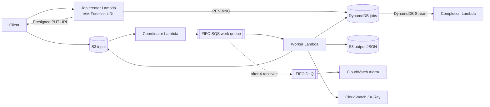

# Event-Driven Media Processing Demo

A clean-room AWS reference implementation that processes uploaded files asynchronously and writes checksum and metadata results with retry-safe state transitions.

> This repository is an independently implemented portfolio project demonstrating general event-driven architecture patterns. It contains no source code, data, configuration, or proprietary algorithms from any employer or client project.

## Problem

Uploading a file is easy; processing it safely under burst traffic, duplicate delivery, timeouts, and partial failures is not. This project keeps the upload request fast, buffers work in SQS, and makes repeated delivery safe through stable IDs, deterministic result keys, FIFO deduplication, and DynamoDB state checks.

## Architecture



The event flow and service trade-offs are detailed in [docs/architecture.md](docs/architecture.md).

## Processing flow

1. An IAM-authenticated Function URL accepts a filename and allowed MIME type, creates a UUID job in `PENDING`, and returns a 15-minute presigned S3 upload URL.
2. An S3 object-created event invokes the coordinator. It validates the `uploads/{jobId}/{filename}` key and sends a version-aware deduplication ID to a FIFO queue.
3. The worker conditionally moves the job to `PROCESSING`, streams at most 20 MiB, and calculates SHA-256 without loading the entire object into memory.
4. The worker writes deterministic JSON to `results/{jobId}.json`, then records `COMPLETED`. A DynamoDB stream handler emits a custom completion metric.
5. Failed records alone are retried. After four receives, SQS moves them to the DLQ and CloudWatch raises an alarm.

## Idempotency and recovery

AWS event delivery is treated as at least once. A completed job is acknowledged without reprocessing; a stable result key makes output writes repeatable; FIFO message grouping serializes one job; and `batchItemFailures` isolates failures within an SQS batch. See [docs/reliability.md](docs/reliability.md) for failure windows, poison messages, and the DLQ redrive runbook.

## Security

S3 public access is blocked, TLS and encryption are required, the upload API uses IAM auth, object types and sizes are bounded, and roles are granted only required resources and prefixes. GitHub deployment uses AWS OIDC rather than access keys. See [docs/security.md](docs/security.md).

## Repository layout

```text
infra/                     AWS CDK stack and assertion tests
services/job-creator/      Job creation and presigned upload URL
services/coordinator/      S3 event validation and queue dispatch
services/worker/           Streaming checksum and state transitions
services/completion-handler/ DynamoDB stream completion metric
shared/                    Event contracts, IDs, and validation
tests/unit/                Behavior and idempotency tests
docs/                      Architecture, reliability, security, and cost notes
scripts/benchmark.ts       Synthetic local checksum timing harness
```

## Local verification

Prerequisites: Node.js 22+ and npm. Deployed functions use the Node.js 24 Lambda runtime because AWS deprecated Node.js 20 in 2026.

```bash
npm ci
npm run lint
npm run typecheck
npm test
npm run synth -- --context stage=dev
```

Tests use injected AWS boundaries and do not need credentials. CDK synthesis bundles Lambda code locally with esbuild but does not create cloud resources.

## Deploy to a development account

Review the synthesized template and expected charges first. Deployment creates billable AWS resources.

```bash
npx cdk bootstrap
npx cdk deploy --context stage=dev
```

The stack output contains an IAM-authenticated Function URL. Call it with a SigV4-capable client using a JSON body such as:

```json
{
  "filename": "synthetic-image.png",
  "contentType": "image/png"
}
```

The included deploy workflow is manual only. Set GitHub repository variables `AWS_ROLE_ARN` and `AWS_REGION` after configuring the role's OIDC trust policy.

## Cost and benchmark method

The serverless design charges primarily per request, duration, storage, logs, and traces. Lambda memory also changes available CPU, so benchmark before choosing a setting. [docs/cost-optimization.md](docs/cost-optimization.md) provides a cost formula and [docs/benchmark.md](docs/benchmark.md) provides the measurement protocol and empty result table.

> Benchmark results were measured using synthetic files in this public demo environment. They do not represent any employer, customer, or production system.

No AWS benchmark numbers are claimed until a deployment is explicitly approved and measured. The local-only timing harness can be run with:

```bash
npm run benchmark -- --file-size-mb 1 --iterations 50
```

## Limitations

- This MVP extracts SHA-256, byte length, and MIME type; it does not transform images or inspect their decoded contents.
- FIFO deduplication has a bounded window. Durable safety comes from job state and deterministic output, not from a claim of exactly-once delivery.
- The demo has no end-user authentication, status-query API, antivirus scan, notification destination, or multi-region recovery.
- The completion handler emits a metric only; a production system would route a domain event to a reviewed destination.
- AWS resources are defined but are not deployed by CI or as part of this repository handoff.

## 한국어 요약

파일 업로드 이후 처리를 SQS로 분리하고, 중복 이벤트·재시도·부분 실패·DLQ를 안전하게 다루는 공개용 AWS 데모입니다. 회사 코드, 내부 설정, 고객 데이터, 운영 수치 또는 비공개 알고리즘을 사용하지 않고 처음부터 독립적으로 작성했습니다.

## License

[MIT](LICENSE)
