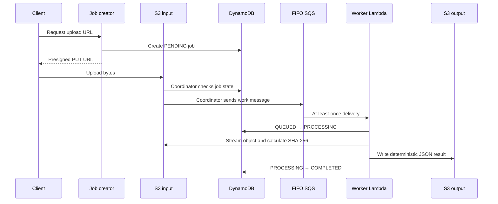

# Architecture decisions

## Processing path

The synchronous endpoint creates a job and a short-lived upload URL; it never processes file bytes. This keeps request latency predictable and prevents API capacity from being tied up by large or slow uploads.

SQS absorbs upload bursts and lets Lambda scale independently. A FIFO queue uses `jobId` as the message group and a stable S3 event identity as the deduplication ID. FIFO deduplication reduces near-simultaneous duplicate dispatches, while DynamoDB state checks provide durable worker idempotency beyond the queue's deduplication window.

## Delivery semantics

S3 events, Lambda event source mappings, and SQS are treated as at-least-once systems. An invocation may complete its side effect and time out before acknowledgment. The design therefore uses a deterministic result key, conditional state transitions, completed-job short-circuiting, and partial batch responses. It does not claim exactly-once delivery.

## Alternatives

Step Functions would make a longer, multi-step workflow and its execution history more explicit, but adds per-transition cost and is unnecessary for one bounded operation. Fargate is a better fit when processing exceeds Lambda's time, memory, temporary storage, or native dependency constraints, or when fixed compute provides better economics. Those options are documented rather than deployed in this MVP.
